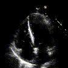

# Precision-Medicine-EchoNet


This repo provides scripts to load the EchoNet-Dynamic database (https://echonet.github.io/dynamic/index.html), and train a baseline model with UNet, ResNet-18 and bidirectional LSTM. Baseline model checkpoint can be downloaded from [here](https://drive.google.com/file/d/1wvTwb3RYrIqviocweQOxsRQN5bgsIiN2/view?usp=sharing). You can download the baseline checkpoint and place it under "Precision-Medicine-EchoNet/checkpoints" directory.

To train a model, simply run the follow script (NOTICE: without adding arguments). Arguments can be utilized to adjust the hyperparameter setting, training strategy and log frequency. "--load" argument will allow user to load pretrained model weights (it needs to be placed in "Precision-Medicine-EchoNet/checkpoints" directory).


Example training command:
```python
python train.py --lr1 1e-5 --lr2 1e-4 --batch_size 16 --use_gt_ef --log_every 200 --device 'cuda' --load 'foo.pt'
```

To perform instance-level inference, run the following code (paths need to be handled in current design):
```python
python inference.py
```


Sample testing output is shown below:

Input video                       |  Model output
:--------------------------------:|:----------------------------------------:
  |  


